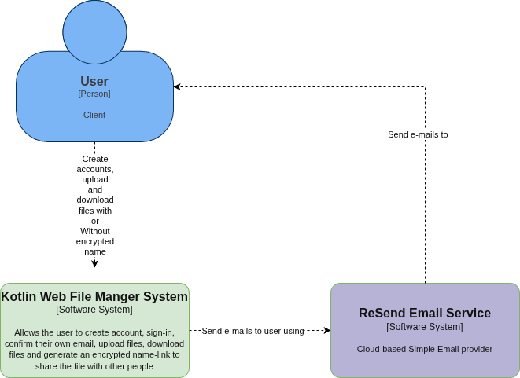

# KWFM Context Diagram

|               |                                  |
| ------------- | -------------------------------- |
| `Participant` | Márcio Alexandre Freire Sindeaux |
| `Date`        | 10/02/2026                       |

## 1.System purpose

KWFM System aims to be an online storage system. It allows people from all over the world to upload their files and share them through a unique URL link.

## 2.Diagram Context

 

 

## 3.System Elements

### 3.1.Actors

- User: user is a person that wants to use our service as a simple storage online.

### 3.2.Software Systems

- Kotlin Web File Manager System: The system that we're building today.
- ReSend Email Service: External System that handles sending email to our users

## 4.Main Interactions

### 4.1.New Account Interaction

1.  The Client wants to create a new Account
2.  The client starts a trasaction inside the Kotlin Web File Manager to create Account
3.  The system Calls ReSend to send an confirmation email to the user
4.  The Client confirms the e-mail to the Kotlin Web File Manager

### 4.2.Uploading File

1.  The Client try to log-in into the system
2.  The System Calls ReSend to send an 2FA number to the e-mail
3.  The Client respond to Kotlin Web File Manager the 2FA Number
4.  The Client receives all the file data from the root directory
5.  The client uploads the file by system.

## 5.Scopes and Boundaries

1.  The Kotlin Web File System cannot allows you to download all your files at the same request
2.  The Kotlin Web File System cannot allows you to share all your files at the same request
3.  The Kotlin Web File System cannot encrypt the files itself, just the name.

## 6.Risks and External Dependencies

### 6.1.About ReSend Email Service

#### 6.1.1.Critical Dependencies

- Confirmation email depends 100% on the ReSend system.
- 2FA login via email depends 100% on the ReSend System

#### 6.1.2. Business Risks

- If the user cannot confirm your own email in 7 days, the account and data has to be deleted.
