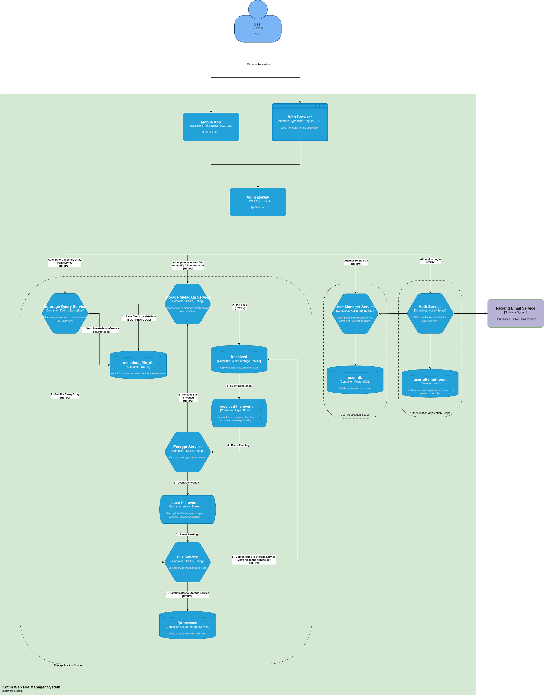

# KWFM Container Diagram Diagram

|               |                                  |
| ------------- | -------------------------------- |
| `Participant` | Márcio Alexandre Freire Sindeaux |
| `Date`        | 16/02/2026                       |

## 1.Document purpose

This document has the purpose of presenting the container diagram for the software system [Kotlin Web File Manager System](../KWFM%20Context%20Diagram.md). It does not show the software as a "to be" vision, but rather aims to represent what the software actually is. This file is not static, but a living document that always reflects what the software is and what it aims to become.

## 2. Diagram Context

 

 

## 3. Container Elements

### Interfaces

- Mobile App (Planned)
- Web Browser (Priority)

### Gateways

- API Gateway: Responsible for encapsulating all API calls, ensuring that the APIs are not exposed. It also functions as a BFF (Backend for Frontend).

### Microservices

- User Manager Service: Responsible for managing the insertion and retrieval of data from registered users.
- Auth Service: Responsible for registering any attempt to log in to any account.
- Storage Metadata Service: Responsible for managing and updating references for folders and files.
- Storage Query Service: Responsible for searching metadata in the database.
- Encrypt Service: Responsible for encrypting the file name if needed.
- File Service: Responsible for moving files from "/received" to "/processed" or retrieving files from the "/processed" folder.

### Databases and Storages

- user_db: Relational database schema to store all user-related data.
- user_attempt_login: Non-relational database schema, used to store all authentication-related logs.
- metadata_file_db: Neo4J database. Responsible for storing all directory trees and references as they are.
- /received: Folder in any cloud storage service. Stores the file byte array itself, but not yet processed or renamed.
- /processed: Folder in any cloud storage service. The location where the file is stored once it has been processed or renamed.

### Event Managers

- received-file-event: Receives and sends events when the "/received" storage receives a new byte array.
- save-file-event: Receives an event with the real or encrypted name and the cloud storage reference in the "/received" folder.
