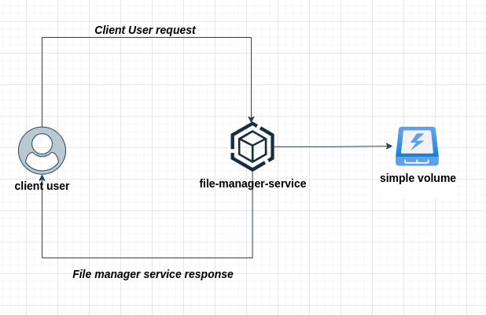
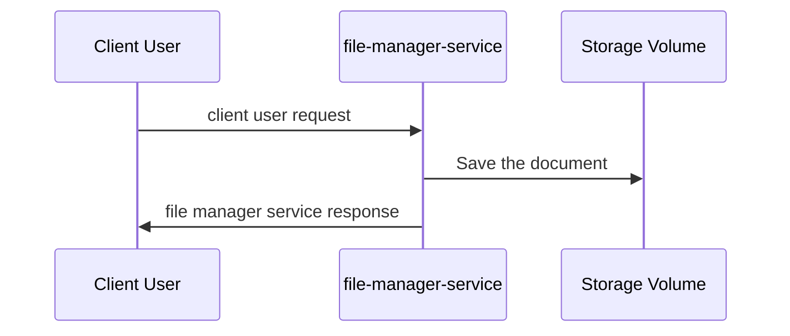

# Solution Design Document 001 - File Upload 

|||
|---|---|
|`Participant`| Márcio Alexandre Freire Sindeaux |
|`Date`| 09/02/2025 |
|`Status`| `Complete`|

## 1.Index

 * 1.Index
 * 2.Basic Advisements
 * 3.Business Description and needs
 * 4.Technical solution and decision.
   * 4.1 About encryption 
   * 4.2 Archtectural Decision
     * 4.2.1 Drawio Diagram / HLD
     * 4.2.2 Sequence Diagram
     * 4.2.3 Requests and Responses Examples
 * 5.Consequences
   *  5.1 Positives 


## 2.Basic Advisements

This document is based on [US 001 - Upload a file](../US%20(User%20story)/001%20-%20Upload%20a%20file.md) and represents a technical solution design to be implemented.

This document was created by a technical person who, together with the Product Owner (PO), interviewed the user and discovered the problems and possible solutions.

## 3.Business Description and needs
Nowadays, the user is unable to upload private and internal files. He needs to use cloud file management tools so that other people can access the files.

He wants it to at least be possible to save internal files outside of third-party services so that internal security can be maintained

The User also wants that when the file is saved, the file name is encrypted so that it is not possible to know from the file name what that file talks about.

## 4.Technical solution and decision.
### 4.1 About encryption 
We decided to use AES as an simple and symetric encryption algorithm. The discussions and decisions generated are documented in the [ADR 003 - About Use AES](../ADR%20(Archtecture%20Decision%20Records)/003%20-%20About%20use%20AES.md)

### 4.2 Archtectural Decision
#### 4.2.1 Drawio Diagram / HLD

#### 4.2.2 Sequence Diagram


#### 4.2.3 Requests and Responses Examples
<details>
<summary>Client User Request</summary>

```shell
curl --request POST \ --url http://file-manager-service.site.com/file/upload \
--header 'Content-Type: multipart/form-data' \ 
--form 'file=C://Users/User/documents/my-document.pdf
```
</details>

<details>
<summary>File Manager Service Response</summary>

```json
{ 
	"filename": "encrypted-name.pdf", 
	"file_extension": "application/octet-stream", 
	"size": 14720 
}
```
</details>


## 5.Consequences
### 5.1 Positives 
 * Uploading the file will be possible to fulfill all functional and non-functional requirements of the requested behaviors
