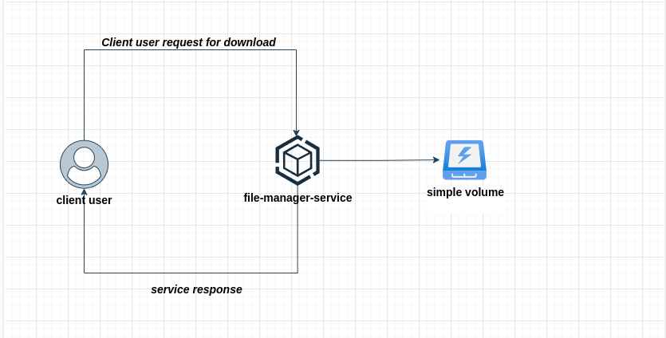
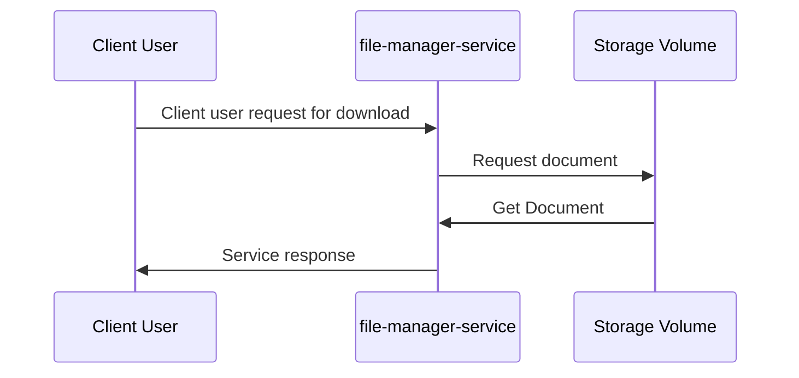

# Solution Design Document 002 - File Download 

|||
|---|---|
|`Participant`| Márcio Alexandre Freire Sindeaux |
|`Date`| 16/03/2025 |
|`Status`| `Complete`|

## 1.Index

 * 1.Index
 * 2.Basic Advisements
 * 3.Business Description and needs
 * 4.Technical solution and decision.
   * 4.1 About encryption and drecryption
   * 4.2 Archtectural Decision
     * 4.2.1 Drawio Diagram / HLD
     * 4.2.2 Sequence Diagram
     * 4.2.3 Requests and Responses Examples
 * 5.Consequences
   *  5.1 Positives 


## 2.Basic Advisements

This document is based on [US 002 - Download a file](../US%20(User%20story)/002%20-%20Download%20a%20file.md) and represents a technical solution design to be implemented.

This document was created by a technical person who, together with the Product Owner (PO), interviewed the user and discovered the problems and possible solutions.

## 3.Business Description and needs
Nowadays users cannot download files from the server

He wants all users who have links with the encrypted file name, or who only have the encrypted file name, to be able to download the file.

He also wants that when downloading the file, the file is downloaded with the original name.

## 4.Technical solution and decision.
### 4.1 About encryption and drecryption
We decided to use AES as an simple and symetric encryption algorithm. The discussions and decisions generated are documented in the [ADR 003 - About Use AES](../ADR%20(Archtecture%20Decision%20Records)/003%20-%20About%20use%20AES.md). For this functionality, we will just decrypt the file name using the base generated at the time of upload.

### 4.2 Archtectural Decision
#### 4.2.1 Drawio Diagram / HLD

#### 4.2.2 Sequence Diagram


#### 4.2.3 Requests and Responses Examples
<details>
<summary>Client user request for download</summary>

```shell
curl --request GET \ --url http://file-manager-service.site.com/file/download/encrypted-name.extension 
```
</details>

<details>
<summary>Service response</summary>
File Raw Source
</details>


## 5.Consequences
### 5.1 Positives 
 * Download the file will be possible to fulfill all functional and non-functional requirements of the requested behaviors
